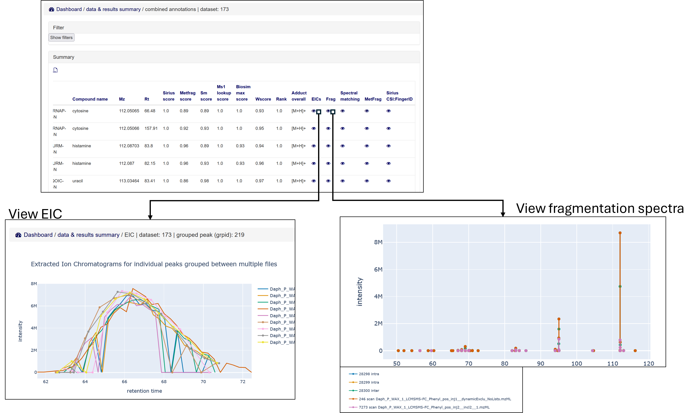

.. _dataandresults-docs:

Data and results
#####################

`dmadb.bham.ac.uk/data_and_results_summary/ <https://dmadb.bham.ac.uk/data_and_results_summary/>`_

Compound annotations
*****************************

All compound annotations dervied from the DMA are summarised at `dmadb.bham.ac.uk/compounds/ <https://dmadb.bham.ac.uk/compounds/>`_.

The annotations have been summarised across all of the DMA assays that have been analysed with Galaxy DMA workflow but also merged with some external annotation sources including annotation via GNPS, mzClould and annotations from NMR and GC-MS.

As the Deep Metabolome Annotation has only been done on one organism (*Daphnia magna*) - this section is currently only summarising the annotation for *D. magna*.  

The compounds are distinguished by a unique InChiKey and can filtered and searched by the following columns

.. list-table:: 
   :widths: 25 50
   :header-rows: 1

   * - Column name
     - Description
   * - Monoisotopic exact mass
     - The monoisotopic exact mass of the annotation (derived from PubChem)
   * - Inchikey
     - InChIKey - International Chemical Identifier Key
   * - Inchi
     - InChi - International Chemical Identifier
   * - Smiles
     - SMILES - Simplified molecular-input line-entry system
   * - Compound name
     - Compound name of annotation
   * - Natural product inchikey1
     - Check if the first component of the InChIKey of the metabolite annotation matches that of the Natural products listed from the "COCONUT - the COlleCtion of Open Natural ProdUcT"   
   * - Pubchem cids
     - List of all PubChem CIDs found for this InChiKey
   * - Hmdb ids
     - List of all HMDB IDs found for this InChiKey
   * - Kegg ids
     - List of all KEGG IDs found for this InChiKey
   * - Chebi ids
     - List of all ChEBI IDs found for this InChiKey
   * - Kingdom
     - Kingdom compound classification from ClassyFire
   * - Superclass
     - Superclass compound classification from ClassyFire
   * - Subclass
     - Subclass compound classification from ClassyFire
   * - Direct parent
     - Direct parent compound classification from ClassyFire
   * - Molecular framework
     - Molecular framework of compound from ClassyFire
   * - Predicted lipidmaps terms
     - Predicted lipidmaps terms of compound from ClassyFire
   * - Extraction
     - DMA liquid phase extraction protocol(s) the annotation observed in
   * - Spe
     - DMA Solid Phase Extraction (SPE) protocol(s) the annotation observed in
   * - Spe frac
     - DMA SPE fraction the annotation observed in
   * - Chromatogprahy
     - DMA chromatography protocol(s) the annotation observed in
   * - Measurement
     - DMA measurement (LCMSMS, DIMSn, GCMS, NMR) protocol(s) the annotation observed in
   * - Polarity
     - The mass spectrometry ionisation polarity the annotation observed in
   * - Nmrbool
     - Boolean - true if annotation observed using NMR measurement
   * - Gcmsbool
     - Boolean - true if annotation observed using GC-MS measurement
   * - Smbool
     - Boolean - true if annotation observed using LC-MS/MS or DIMSn spectral matching to library spectra
   * - Metfragbool
     - Boolean - true if annotation observed using MetFrag annotation software for LC-MS/MS or DIMSn data
   * - Siriusbool
     - Boolean - true if annotation observed using SIRIUS CSI:FingerID annotation software for LC-MS/MS or DIMSn data
   * - Siriusbool
     - Boolean - true if annotation observed using SIRIUS CSI:FingerID annotation software for LC-MS/MS or DIMSn data
   * - Mzcloudsmbool
     - Boolean - true if annotation observed using mzCloud database for LC-MS/MS or DIMSn spectral matching annotation
   * - Galaxysmbool
     - Boolean - true if annotation observed using Galaxy workflow for LC-MS/MS or DIMSn spectral matching annotation
   * - Gnpssmbool
     - Boolean - true if annotation observed using GNPS workflow for LC-MS/MS or DIMSn spectral matching annotation
   * - Msi level
     - The Metabolomics Standards Initiative (MSI) level for the annotation

    
  Fig 1. Browse and filter compound annotations

Individual compounds can be double clicked on to open up a page summarising where the annotations has been observed (currently only showing information related to DMA of *D. magna*)
  

    
  Fig 2. Further details of compound annotations

Browse raw data files
**********************************************************

The raw (and .mzML) data files can be browsed, filtered and downloaded from `dmadb.bham.ac.uk/mfile_summary/ <https://dmadb.bham.ac.uk/mfile_summary/>`_.

    
  Fig 3. Browse, filter and download raw (and .mzML) mass spectrometry data files

Browse datasets and view peaklists
**********************************************************
The DMA Galaxy workflow outputs as a result an SQLite file for each DMA assay that has been analysed (incoporating the annotation and peak information from LC-MS, LC-MS/MS, DIMS and DIMSn data).

Each of these SQLite data files can be individually inspected through the DMAdb interface from `dmadb.bham.ac.uk/dataset_summary/ <https://dmadb.bham.ac.uk/dataset_summary/>`_. 

To access this information a user needs to have an account (i.e. a guest cannot access)

First the user can select the processed data file to choose from via using the filter option and can choose from the following options:

.. list-table:: 
   :widths: 25 50
   :header-rows: 1

   * - Column name
     - Description
   * - Assay name
     - The DMA assay from which the data was derived from
   * - Polarity
     - The mass spectrometry ionisation polarity from which the data was dervied from
   * - Metabolite standard 
     - Boolean - if true, then the data and results are for a metabolite reference standard mix (e.g. the assay was used for validation purposes rather that measuring the metabolite directly in an organism)
   * - Fractionation
     - Boolean - if true, then the data and results are from the DMA fractionation assays and include information and annotations for both LC-MS, LC-MS/MS and the DIMS and DIMSn of LC fractions

    
  Fig 4. Select dataset to inspect

For each dataset a summary of all features and the associated annotations is then shown which in turn can be filtered.

.. list-table:: 
   :widths: 25 50
   :header-rows: 1

   * - Column name
     - Description
   * - Inchikey
     - InChIKey - International Chemical Identifier Key
   * - Compound name
     - Compound name of annotation
   * - Ms type
     - Mass spectrometry type (Fractiontaion data can either be "lcms" or "dims" if from the LC fractions)
   * - Sid
     - Scan peak id (unique id for this dataset for the "dims" peak)
   * - Grpid 
     - Grouped peak id (unique id for this dataset for the grouped LC-MS peak)
   * - Grp name
     - The name given by XCMS to the grouped LC-MS peak
   * - Mz
     - *m/z* of the peak
   * - Rt
     - Retention time of the peak 
   * - Well
     - If the peak from an LC fraction, the well from which the the DIMS data was taken
   * - Sm score
     - Spectral matching score - values between 0 to 1 (dpc)
   * - Metfrag score
     - MetFrag annotation score (weighted score - see Galaxy workflow) - values between 0 to 1
   * - Sirius score
     - SIRIUS CSI:FingerID score (the ranking fro SIRIUS CSI:FingerID was converted to a value between 0 to 1 using a `"minmax" normalisation <https://github.com/computational-metabolomics/msPurity/blob/d32903e1bb63106158dcc4e5de3a02b2f4013d05/R/combineAnnotations.R#L291-L295>`_.)
   * - Ms1 lookup score
     - A binary score, wherer 1 signifies a match of the a calculated neutral mass to a public metabolite database and 0 signifies there was no match
   * - Biosim max score
     - A tanimoto similarity analysis between the structure of the annotated compound against a preselected list of compounds known to be from "biology" from HMDB
   * - Wscore
     - A weighted score bteween 0 to 1 of - see the DMA Galaxy workflow for details of the weighting
   * - Rank
     - A rank derived from the Wscore
   * - Adduct overall
     - All adducts used to calculate the annotation

The weighted scores for "Sm score", "MetFrag score", "Sirius score", "Ms1 lookup score" and "Biosim max score" are all show in the table with the suffix **"wscore"**. See the DMA alaxy workflow for details of the weightings used.

Views of the extracted ion chromatogram and fragmentation data can the be viewed.

The fragmentation data shown for both the individual spectra, the averaged spectra within the a file (intra) and the averaged spectra across all files (inter.)

    
  Fig 5. Filter the features of the dataset and view EIC and fragmentation data

The mass spectrometry fragmentation based fragmentation annotation results from DMA Galaxy workflow can also be viewed in further detail (Spectral matching, MetFrag and SIRIUS CSI:FingerID)

    
  Fig 6. View the mass spectrometry fragmentation based fragmentation annotations derived from the DMA Galaxy workflow (Spectral matching, MetFrag and SIRIUS CSI:FingerID)

Search exact mass of annotations
**********************************************************

Spectral matching of mass spectrometry fragmentation data 
**********************************************************

Upload annotations and datasets (admin only)
**********************************************************

