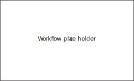
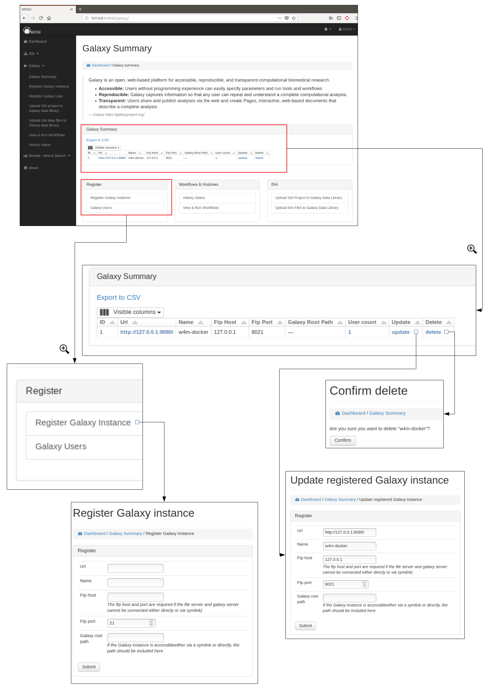
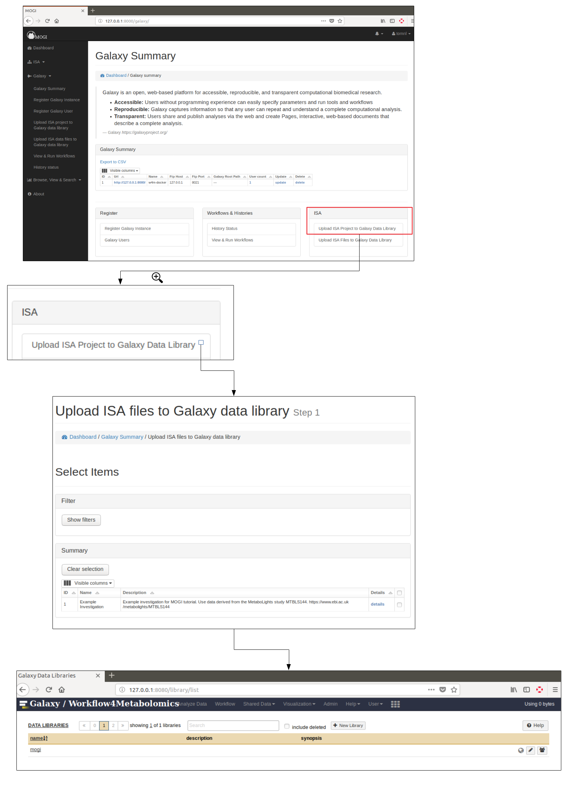
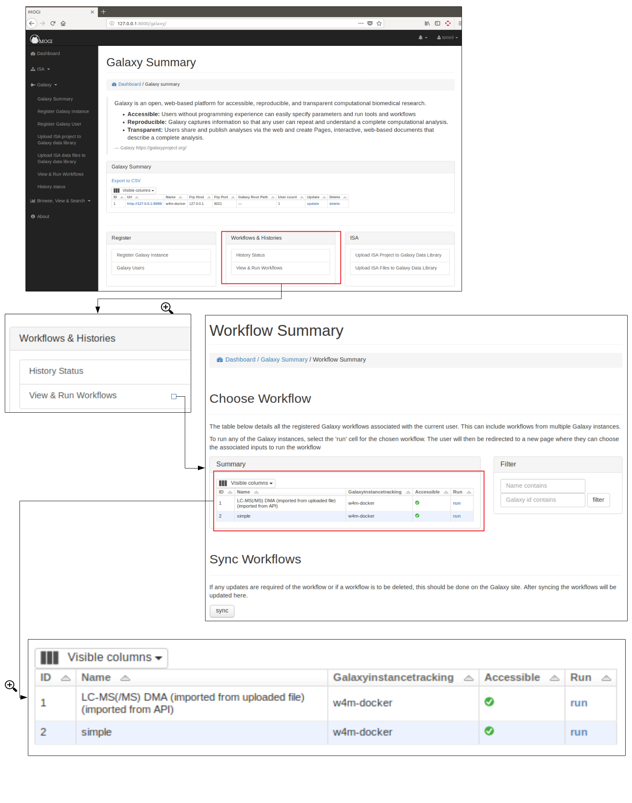
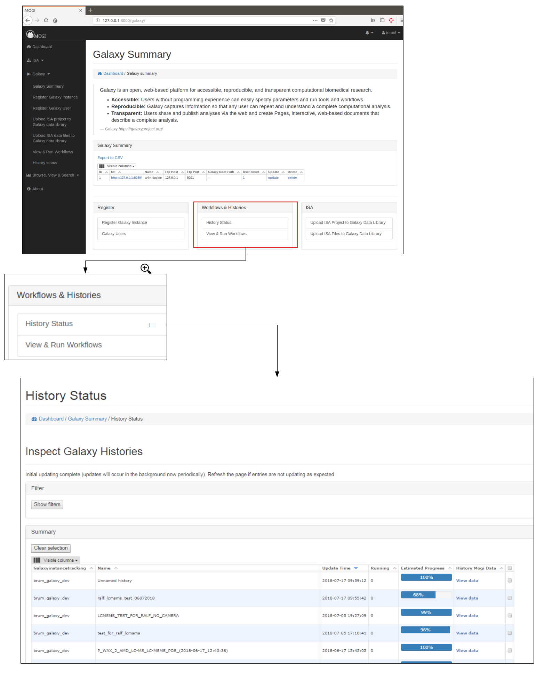

.. _dma-galaxy-workflow-docs:
DMA Galaxy
##########

`dmadb.bham.ac.uk/galaxy/ <https://dmadb.bham.ac.uk/galaxy/>`_

DMA Galaxy Workflow
******************************************

The main source of annotation results with DMAdb come from the DMA Galaxy workflow.

The workflow was created to handle data coming from LC fractionation experiments with multiple types of fragmentation data (LC-MS, LC-MS/MS, DIMS and DIMSn). 

Where by multiple wells of eluent (fractions) was collected whilst performed LC-MS and LC-MS/MS measurements. These fractions then underwent additional mass spectrometry analysis in the form of DIMS and DIMSn. The DIMSn consisting of multiple collision energies and multiple stage fragmentation.

The data is derived from both a single biological sample (i.e. a pooled *Daphnia magna* sample) and an equivelent blank sample to perform blank subtraction of features (where necessary).

    
  Fig 12. DMA Galaxy workflow (image to be added following publication release)

For DMA of *D. magna*, the DMA Galaxy workflow was ran for each "assay" based on the ISA mapping of the project within DMAdb. 

All the relevant data from the DMA of *D. magna* had been uploaded into registered Galaxy instance (and structured within the ISA mapping - see the `DMA Galaxy library <https://dma.galaxy.bham.ac.uk/library/folders/F039bd4581e6624a3>`_). 

This meant that DMA workflow could be ran directly via the Galaxy interface or via a Bioblend script that has access to the DMAdb Django API. For less complicated workflows the DMAdb interface could also be used, however this becomes in practical when multiple data inputs and parameters are to be used.

The final output of the DMA Galaxy workflow for each assay is an SQLite file that contains all details of the annotations and relevant peak, mass spectrometry scan and file information.

These SQLite files can then be uploaded, viewed and searched within DMAdb (see :ref:`dataandresults-docs`).

Galaxy interactions (Admin only)
******************************************

Register Galaxy instance (Admin only)
''''''''''''''''''''''''''''''''''''''''''''''''''

A Galaxy instance needs to be registered before any of the django-galaxy functionality can be used. The Galaxy
instance should be accessible directly (or via symbolic link) on the file system that is running the Django instance.

Register Galaxy user (Admin only)
''''''''''''''''''''''''''''''''''''''''''''''''''
Each admin user can be registered to any of the registered Galaxy instance. The API key that has is
provided by the user allows permission of the Galaxy instance API to be used.

.. figure:: images/galaxy2.png

Upload ISA projects to Galaxy data library (Admin only)
''''''''''''''''''''''''''''''''''''''''''''''''''''''''
If a ISA project has be created and data has been uploaded into an assay. This data can be uploaded into the Galaxy
Data libraries. If the Galaxy instance is on the same file system (or accessible by a symbolic link) then the files
can be uploaded as symbolic links. This is useful if there is limited space available for Galaxy instance. 

Run Workflows (Admin only)
''''''''''''''''''''''''''''''''''''''''''''''''''
All workflows for each Galaxy instances can be synced with Django file system so they can be run directly from the django
interface. In cases where there are multiple file inputs and paramaters this is not practical and not advised.

View Galaxy histories (Admin only)
''''''''''''''''''''''''''''''''''''''''''''''''''
All histories for each Galaxy instances are summarised.

