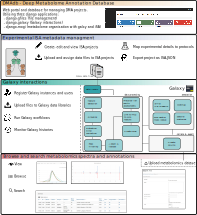

.. _getting-started:

Getting started
#####################
.. role:: bash(code)
   :language: bash

`dmadb.bham.ac.uk <https://dmadb.bham.ac.uk>`_

DMAdb introduction
********************

The DMAdb site, is a web application that has been created as a way to both aid in organising, analysing and disseminating the metabolite annotations, mass spectrometry datasets and experimental meta information on "Deep metabolome annotation" (DMA) projects. 

DMA projects consist of large scale attempts to annotate as many compounds as possible in representative sample of an organism (e.g. *Daphnia magna*) or a sample type of an organism. This is achieved by performing multiple physio-chemical separations (e.g. Solid Phase Extraction, Liquid Chromatography, Liquid Chromatography fractionations) and extensive mass spectrometry analysis (including multi-stage fragmentation).

**Note that the data present in the current iteration of the DMAdb site is currently only derived from the Deep Metabolome Annotation of Daphnia magna**.

The DMAdb site is built of from three Django applications, which are designed to be used together to provide a comprehensive solution for managing and analysing metabolomics data. See below:

* django-mogi
* django-galaxy  
* django-gfiles

    
  Fig 1. DMAdb summary

Logging into DMAdb
********************

One can login to DMAdb by using an existing gmail account or by signing up to an account.

Otherwise contact t.n.lawson@bham.ac.uk to create an account.

User permissions
********************

There are three main users of the site. 

* **Guest users** (not logged in) - These users are able to browse the data within DMAdb but are not able to run searches across the annotations and data.
* **Registered users** - These users have access to browse, perform searches (including spectral matching) and save the searches.
* **Admin users** - These users have all the access of standard registered user but also have access to upload and edit data, run analysis via a linked Galaxy instance and upload data analysis results.

Site overview
********************

The site has five sections (Dashboard, ISA, Galaxy, Data & Results and About).

* **Dashboard** - A simple overview of the data within DMAdb
* **ISA** - The section details the experimental data within DMAdb represented in the ISA structure (i.e. 'Investigation' (the project context), 'Study' (a unit of research) and 'Assay' (analytical measurement) data model). Registered and guest users are able to look through the study structure DMA projects. Whereas admin users are able to upload new ISA projects into DMAdb. We note that DMAdb only currently only consists of one project. The Deep Metabolome Annotation of *D. magna*
* **Galaxy** - This section details the Galaxy instance(s) linked to the DMAdb instance. Registered and guest users can only view the linked Galaxy instances but are not able to perform any other actions. The admin user can add new instances and associated users, upload data and run workflows. 
* **Data & Results** - This section allows registered users to browse the annotations, data files and individually processed and annotated datasets. As well as searching the annotations either via searching of exact masses or via spectral matching. Guests have more limited browse and search permissions. Admin users are able to upload the annotations and processed datasets.
* **About** - Contact and funding details
