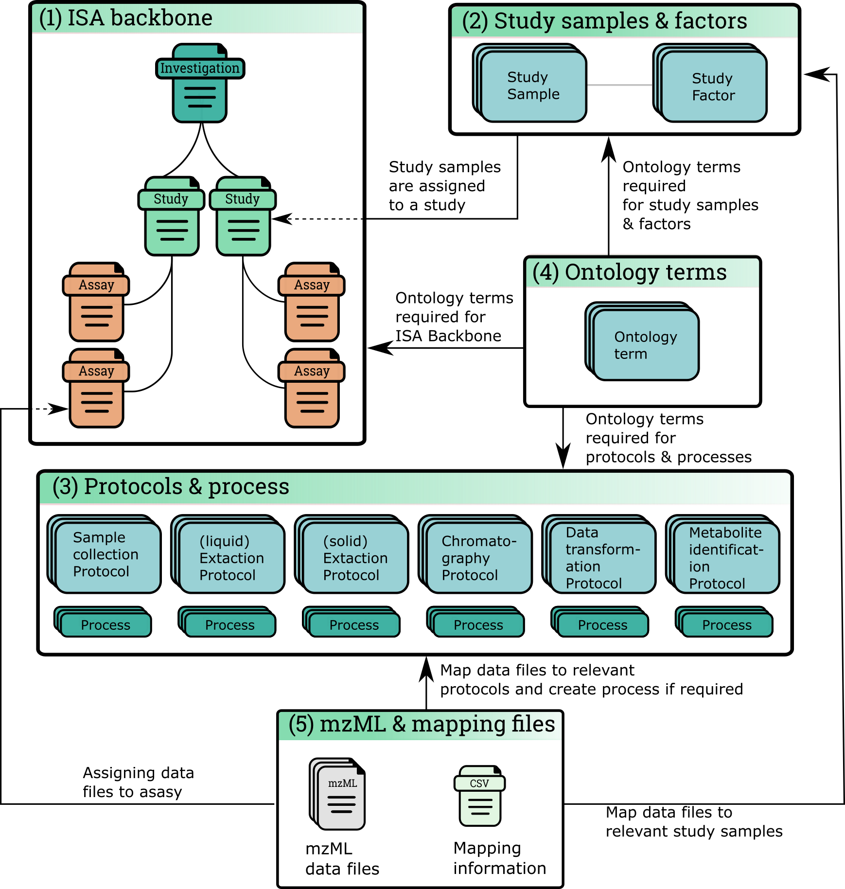

.. _misa-user-docs:

DMA ISA projects
################################################

`dmadb.bham.ac.uk/misa/ <https://dmadb.bham.ac.uk/misa/>`_

   
   Fig 1. Summary of ISA structure within DMAdb. (1) ISA backbone of investigation, study and assay is created. (2) Study samples and relevant study factor details are recorded for the ISA project. (3) Protocols for keys steps in the metabolomics experiments are created. When a protocol is recorded as being used, a relevant process object is created that details relevant ‘run time’ information. (4) Ontological terms are used for the ISA backbone, study factors and protocols and processes. (5) Metabolomics data files can be uploaded to a relevant assay

Browse ISA projects
''''''''''''''''''''''''''''''''''''''''''''''''''

Registered users and guests can browse the available ISA projects. Further details of each ISA project can 
be shown by clicking on the details section.

Preliminary work has been made so that the ISA project can be exported as an ISA-JSON file.

.. image:: images/summary-options.png

Create ISA project (Admin only)
''''''''''''''''''''''''''''''''''''''''''''''''''

To initiate an ISA project the backbone of the ISA project has to be created. e.g. the investigation, study and assay
details.

First an investigation has to be created, this only requires the name of the overall ISA project and a short description.
One or more studies can then be created and assigned to an investigation. Further details are added at this stage including
any study descriptors.

Multiple assays can then be added to each study.

.. image:: images/misa-create-base.png

Ontologies
''''''''''''''''''''''''''''''''''''''''''''''''''

Ontology terms
~~~~~~~~~~~~~~~~~~~~~~~~~~~~~~~~~~~~~~~~~~~~
Where possible ontological terms are used to describe components of the Deep Metabolome Annotation ISA project. The full list of ontology terms
used for a project can be searched and viewed. Where the admin user can add and update.

.. image:: images/ontology1.png

Add new terms (Admin only)
~~~~~~~~~~~~~~~~~~~~~~~~~~~~~~~~~~~~~~~~~~~~
New ontological terms can be added manually or can be searched using the EBI ontology Lookup service and the best
term can be added into the local database of ontology terms.

.. image:: images/ontology2.png

Protocols
''''''''''''''''''''''''''''''''''''''''''''''''''

Browse protocols
~~~~~~~~~~~~~~~~~~~~~~~~~~~~~~~~~~~~~~~~~~~~

Protocol models have been created based on the MetaboLights description for metabolomics projects and consists
of sample collection, (liquid phase)-extraction, (solid phase)-extraction, chromatography,
measurement (i.e. mass spectrometry type), data transformation and metabolite identification.

.. image:: images/protocol1.png

Create, edit and delete protocols (Admin only)
~~~~~~~~~~~~~~~~~~~~~~~~~~~~~~~~~~~~~~~~~~~~

A user can view, edit and delete protocols, see below for example using the Chromatography protocol. An important
field for a protocol is the **code_field** this is a unique small code for a protocol that can be used later when linking
uploaded data files to a specific protocol.

.. image:: images/protocol2.png

Protocol types
~~~~~~~~~~~~~~~~~~~~~~~~~~~~~~~~~~~~~~~~~~~~

Where possible, protocols can be grouped together by different protocol types. For example a Chromatography protocol
can be associated with either the Chromatography type 'HILIC' or 'reverse phase chromatography' (see below). An admin user can add and edit as many different
protocol types as necessary.

.. image:: images/protocol3.png

Study samples
''''''''''''''''''''''''''''''''''''''''''''''''''
Study samples describe the sample used for the Deep Metabolome Annotation.

Study samples can be browsed by any user. Admin users can also create, edit and delete.

.. image:: images/study-sample1.png

Study factors, organisms and organism parts
~~~~~~~~~~~~~~~~~~~~~~~~~~~~~~~~~~~~~~~~~~~~~~~~~~~~~~~~~~~~~~~~~~~~~~~~~~~~~~~~~~~~~~~~
Each study factor can be associated with an organism and organism part as well as multiple study factors.

.. image:: images/study-sample2.png

Batch add study samples (Admin only)
~~~~~~~~~~~~~~~~~~~~~~~~~~~~~~~~~~~~~~~~~~~~
For studies with many samples it is recommended to batch upload the study samples. Relevant ontology terms will be
automatically uploaded based on the sample list provided. The columns of the sample list should consist of the
following column titles:

- **source_name**: Source of the sample (e.g. Acme laboratories).
- **sample_name**: Study sample name (needs to be unique for the study).
- **organism**: Organism name (e.g. *Daphnia magna*). Best matching ontological term will be automatically searched.
- **organism_part**: The part of the organism for the sample (e.g. heart, lung). Best matching ontological term will
  be automatically searched.
- **factor_[<--name of study factor-->]**: A study factor for the sample. The column name will change based on
  the factor type e.g. \factor_[time]. Relevant ontological terms will be automatically searched.
- **factor_[<--name of study factor-->]_unit**: Optionally a unit for the study factor can be used. The column should
  match the study factor type e.g \factor_[time]_unit.  Relevant ontological terms will be automatically searched.

Multiple factor columns can be used
e.g.

+-----------------------------------------------+---------------------+---------------------------+----------------+----------------+---------------------+--------------------+
| \source_name                                  | \sample_name        | \organism                 | \organism_part | \factor_[time] | \factor_[time]_unit | \factor_[control]  |
+===============================================+=====================+===========================+================+================+=====================+====================+
| Acme laboratories                             |  Mtab_FT_012611_13  |  Thalassiosira pseudonana | exometabolome  | 1              | day                 | with Thalassiosira |
+-----------------------------------------------+---------------------+---------------------------+----------------+----------------+---------------------+--------------------+
| Acme laboratories                             |  Mtab_FT_012611_14  |  Thalassiosira pseudonana | exometabolome  | 2              | day                 | cell-free control  |
+-----------------------------------------------+---------------------+---------------------------+----------------+----------------+---------------------+--------------------+

Alternatively, if an ISA tab file has already been created. The study.txt file can be uploaded and the relevant details
will be extracted.

See below for how to upload study samples as a batch:

.. image:: images/study-sample3.png

Study Factors
''''''''''''''''''''''''''''''''''''''''''''''''''
Study factors provide ways of adding relevant variables for the study samples.

Due to the nature of the original Deep Metabolome Annotation work with Daphnia magna involving one biological sample, the study factors were not considered. 

However DMAdb does have functionality to incoporate.

.. image:: images/study-factor1.png

Organisms
''''''''''''''''''''''''''''''''''''''''''''''''''
The organism for which the DMA project was performed on.

Admins are able to either add manually (see below) or added with study samples in a batch process (see section "Batch add study samples")

.. image:: images/organism.png

Organism parts
''''''''''''''''''''''''''''''''''''''''''''''''''
The organism part for which the DMA project was performed on.

Admins are able to either added manually (see below) or added with study samples in a batch process (see section "Batch add study samples")

.. image:: images/organism_parts.png

Assay details and data files
''''''''''''''''''''''''''''''''''''''''''''''''''
All users are able to browse and view the assays of a DMA ISA project.

Admin users are able to upload data files (e.g. mzML) to an assay, first an assay needs to have been created for the appropriate study (see
section **Create ISA backbone**. The assay should then be viewable in the Investigation details section. See below for
example:

.. image:: images/assay_details1.png

Upload data files and mapping (Admin only)
~~~~~~~~~~~~~~~~~~~~~~~~~~~~~~~~~~~~~~~~~~~~~~~~~~~~~~~~~~~~~~~~~~~~~~~~~~~~~~~~~~~~~~~~
Data files (e.g. mzML, raw) should be uploaded to the appropriate assay for a study. This can either be done by
uploading a zip file of the data files or providing a path to the data files if the file system is available.

A mapping file should be provided that links each file to sample and protocols. Each protocol has a 'code_field' to be
used to reference the correct protocol that was performed. See below for accepted column details

- **filename**: Name of the data file (e.g. sample1_lcms.mzML)
- **sample**: The sample name (should correspond to the sample name provided at earlier stages)
- **sample_collection**: The code_field for the sample collection protocol performed
- **extraction**: The code_field for the liquid phase extraction protocol performed
- **spe**: The code_field for the solid phase extraction protocol performed
- **spe_frac**: If SPE fractionation was performed resulting in multiple fractions, this column is to indicate the fraction number
- **chromatography**: The code_field for the chromatography protocol performed
- **chromatography_frac**: If chromatography fractionation was performed resulting in multiple fractions, this column is to indicate the fraction number
- **measurement**: The code_field for the measurement protocol performed
- **polarity**: The code_field for the polarity setting of the instrument
- **technical_replicate**: Numerical value indicating technical replicate
- **fileformat**: suffix of the file being uploaded (currently supports mzML and raw)

If a protocol was not used (e.g. if Chromatography was not performed) the column in the mapping file should be NA. See
below for example format:

+---------------------------+---------------------+--------------------+----------------+--------+----------+-----------------+----------------------+-------------+----------+---------------------+------------+
| filename                  | sample              | sample_collection  | extraction     | spe    | spe_frac | chromatography  | chromatography_frac  | measurement | polarity | technical_replicate | fileformat |
+===========================+=====================+====================+================+========+==========+=================+======================+=============+==========+=====================+============+
| Mtab_FT_012611_13_1.mzML  |  Mtab_FT_012611_13  |  DIATOM            |  DOM	        | DOM    | NA       | SFRP            | NA                   | FT-ICR      | POSITIVE | 1                   | mzml       |
+---------------------------+---------------------+--------------------+----------------+--------+----------+-----------------+----------------------+-------------+----------+---------------------+------------+
| Mtab_FT_012611_13_2.mzML  |  Mtab_FT_012611_13  |  DIATOM            |  DOM	        | DOM    | NA       | SFRP            | NA                   | FT-ICR      | POSITIVE | 2                   | mzml       |
+---------------------------+---------------------+--------------------+----------------+--------+----------+-----------------+----------------------+-------------+----------+---------------------+------------+

.. image:: images/assay_details2.png